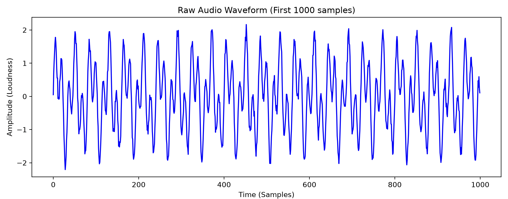
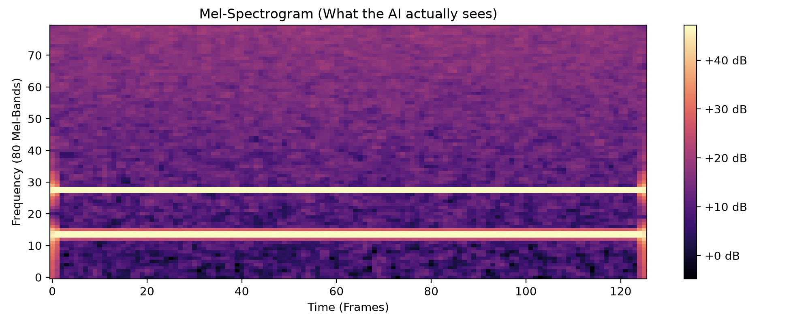

# PyTorch Audio Processing: Waveform to Mel-Spectrogram

This repository contains a foundational PyTorch implementation for audio preprocessing. Transforming raw audio into a visual representation is a critical first step when building complex deep learning audio architectures, such as Text-to-Speech (TTS) systems or speech recognition engines.

## 📌 Project Overview

The project demonstrates how to generate synthetic audio data and process it into a Mel-Spectrogram. Instead of feeding raw, 1D audio waves directly into a neural network, deep learning models perform significantly better when analyzing 2D time-frequency representations. This script handles that end-to-end transformation.

## 📊 Visualizing the Audio Data

### Raw Audio Waveform

The raw 1D time-domain signal, representing the amplitude (loudness) of the sound over time.

### Mel-Spectrogram

The resulting 2D feature map that the neural network actually "sees." It represents frequency bands over time, scaled to match human auditory perception.

---

## 🏗️ Pipeline Architecture

The audio processing pipeline consists of three core stages:

1. **Signal Generation:** Creates a 2-second synthetic audio waveform by combining a low-pitch sine wave (400 Hz) and a high-pitch sine wave (1000 Hz), injecting Gaussian noise to simulate real-world audio variance.
2. **Mel-Spectrogram Transformation:** Utilizes `torchaudio.transforms.MelSpectrogram` to convert the raw 1D waveform into a 2D matrix. This breaks the audio down into 80 distinct Mel-frequency bands.
3. **Logarithmic Scaling:** Applies `torchaudio.transforms.AmplitudeToDB` to convert the power spectrogram into a decibel (dB) scale. This compresses the dynamic range, making the features much easier for a neural network to process and learn from.

## ⚙️ Processing Parameters

The transformation relies on the following audio processing hyperparameters:

- **Sample Rate:** 16,000 Hz
- **Audio Duration:** 2 seconds
- **Total Samples:** 32,000
- **FFT Size (`n_fft`):** 1024
- **Hop Length:** 256
- **Mel-Bands (`n_mels`):** 80

_Output Tensor Shape:_ `[1, 80, 126]` (Channels, Mel-Bands, Time-Frames)

---

## 🛠️ Requirements

- Python 3.7+
- `torch`
- `torchaudio`
- `matplotlib`
