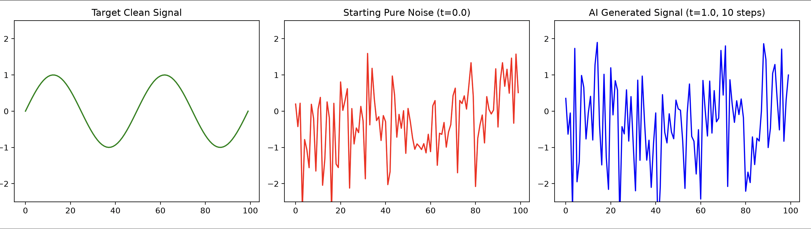

# Simple Flow Matching from Scratch with PyTorch

A lightweight, educational implementation of **Conditional Flow Matching (CFM)** using PyTorch. This project demonstrates how modern generative AI architectures—like the acoustic synthesis engines powering state-of-the-art Text-to-Speech (TTS) models such as **CosyVoice 2**—mathematically transform pure random static into structured data sequences.

---

## Core Concepts

Unlike traditional diffusion models that use complex, curved paths to remove noise, **Flow Matching** builds a flat, straight-line vector field mapping raw noise ($t=0.0$) directly to target clean data ($t=1.0$).

1. **Linear Interpolation:** During training, we drop the model into random time steps $t \in [0, 1]$ using the formula:
   $$\mathbf{x}_t = (1 - t)\mathbf{x}_0 + t\mathbf{x}_1$$
2. **Vector Field Target:** The network learns to predict the constant velocity pointing from noise to clean data:
   $$\mathbf{v}(\mathbf{x}_t, t) = \mathbf{x}_1 - \mathbf{x}_0$$
3. **Euler ODE Sampling:** During generation (inference), we sample fresh Gaussian noise and take discrete time-steps guided by the model's velocity vectors to progressively carve out our clean signal.

---

## Results Visualization

When you run the script, a neural network trained for just 1,000 steps uses an Ordinary Differential Equation (ODE) solver loop to transform a chaotic starting point into a smooth wave function in 10 steps.



- **Left (Green):** The target clean sine wave signal we want the AI to learn.
- **Middle (Red):** The starting pure Gaussian noise ($\mathbf{x}_0$) at $t=0.0$.
- **Right (Blue):** The generated output ($\mathbf{x}_1$) at $t=1.0$ after 10 iterative steps.

---

## Project Structure

The single-file implementation contains the following sequential pipeline:

- **Dataset Generation:** Creates a deterministic 1D sequence using a sine function alongside standard normal noise distributions.
- **FlowPredictor Neural Network:** A multi-layer perceptron (MLP) architecture using PyTorch `nn.Sequential` that conditions predictions by concatenating the raw data tensor with the scalar time variable $t$.
- **Training Loop:** Optimizes parameters via Mean Squared Error (`nn.MSELoss`) against the true straight-line velocity field trajectory.
- **Inference Pipeline:** Implements a strict `torch.no_grad()` execution wrapper utilizing the Euler forward integration scheme.

---

## Getting Started

### Prerequisites

Ensure you have a Python environment setup with the mandatory numeric processing and visualization libraries:

```bash
pip install torch matplotlib
```
